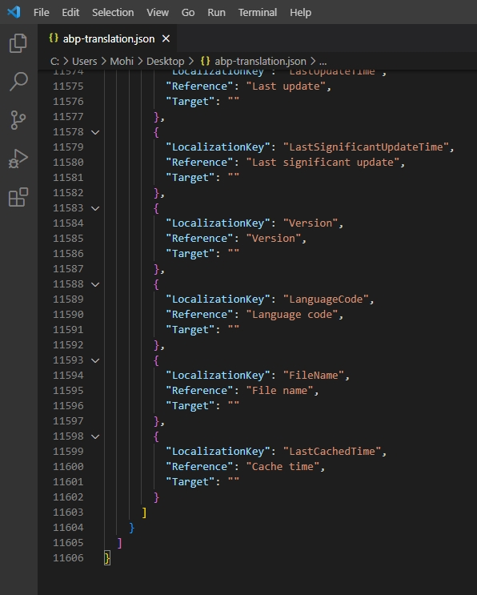
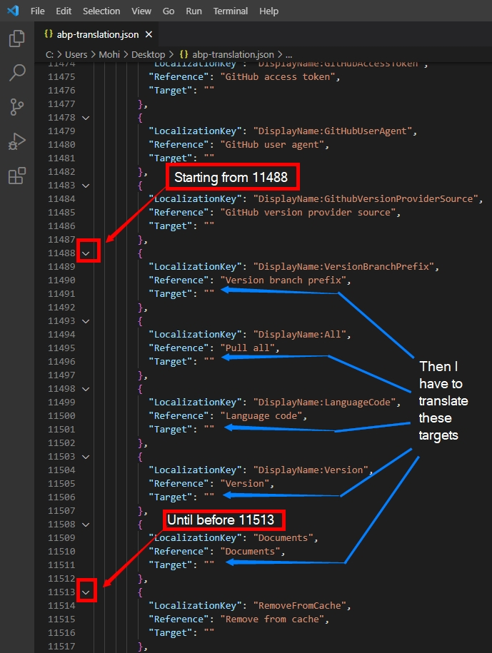

# abp-farsi
This repository is created to translate localization file of the [ABP Framework](https://github.com/abpframework/abp) to the Farsi, aka the Persian language. The aim is to help Iranian developers leverage the [ABP Framework](https://github.com/abpframework/abp)'s power for their local projects.

How to contribute:

Reference to [Resource Localization](https://docs.abp.io/en/abp/latest/Contribution/Index#resource-localization), we have an `abp-translate.json` file which includes all necessary key/values of the localizations which I already executed `abp translate -c fa` command and generated latest version (5.2.1) of the file.
First, it is much better to finish the complete translation of `abp-translate.json` and then start a PR.

To avoid conflict, I believe we can open an issue, select a range of translations each time, and then close the issue after finishing the range. Check the below example:

There are total of `11606` lines of data:

And we can create a new issue (for example [translate 1368~2373](https://github.com/mheidari988/abp-farsi/issues/1)) and translate every target `starting from` 1368 `until before` 2373 line.

Another example:
Say I open an issue `translate 11488~11513`, then I'm responsible for translating targets as per the below demonstration:

Please share any other ideas in the issue section.